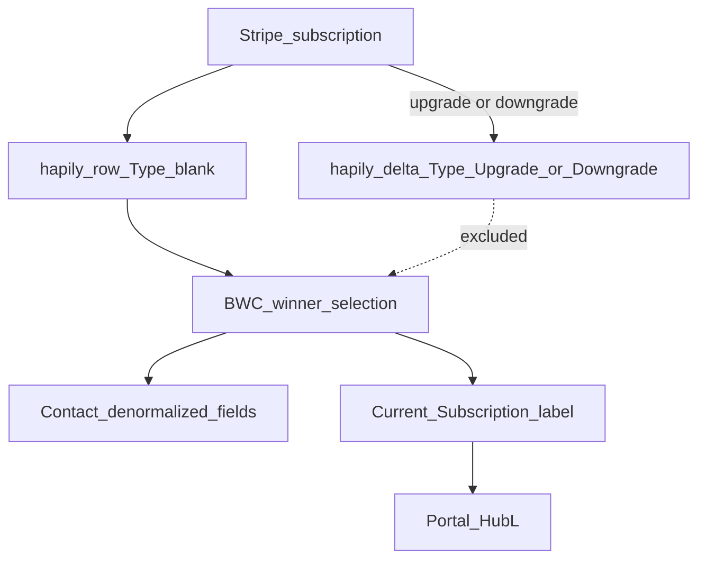
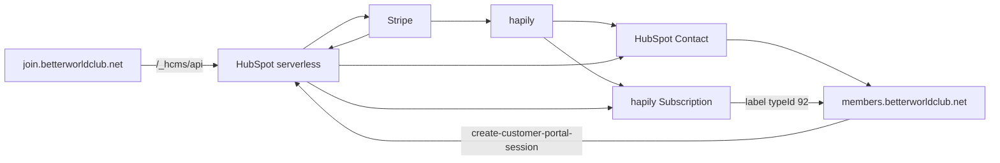

# Current state

BWC membership is a Stripe-billed product, mirrored into HubSpot by hapily, then reduced by custom code to **one current membership** on the Contact and member portal.

Portal: `44020082`. Snapshot: 2026-09-19.

## Hapily vs BWC

| Concern | Owner |
| --- | --- |
| Payment, Customer, Subscription, Invoice | Stripe |
| Mirror Stripe Customer / Subscription / Transactions into HubSpot | hapily (Zaybra object names still appear in HubL) |
| One current membership on Contact + portal | BWC custom |
| Checkout, write-once `join_date`, member card, Billing Portal | BWC custom |

Hapily maps Stripe Customer → Contact by email. On upgrade/downgrade it **updates** the live hapily Subscription **and creates a delta row** with the same Stripe `subscription_id` and `Type` = Upgrade or Downgrade. That is why winner selection exists. See [05-data-and-rules.md](./05-data-and-rules.md).

hapily docs (reference only): [Enterprise data sync](https://saas.hapily.com/docs/data-sync-from-stripe-to-hubspot-enterprise-hubspot), [Help center](https://docs.hapily.com/saas-hapily), [How to update a subscription](https://docs.hapily.com/saashapily/how-to-update-a-subscription).

## System context

## Happy path (Confirmed)

1. Join module loads products from `GET /_hcms/api/get-stripe-product-data`.
2. Net-new: `POST handle-customer-information`, then `POST handle-submit` → Stripe Checkout URL.
3. Logged-in: `isRenewal = true` → `POST handle-renewal-submit` instead.
4. Stripe Checkout; user pays.
5. Parallel: hapily syncs Customer/Subscription; custom `join-date-mapping` listens for checkout completion; `generate-member-card-no` waits for a hapily Subscription then writes `member_card_no`.
6. `updateContactFields` picks a winner (excludes hapily deltas), copies fields onto the Contact, stamps **Current Subscription** (`typeId` 92).
7. Portal HubL reads that labeled association. Billing Portal uses `customer_id` from that record.

## Component inventory

| Piece | Location | Live vs archive |
| --- | --- | --- |
| Join UI | `bwc-quote-form/main.js` + `modules/app.module` | Live bundled JS. `src/` is incomplete vs bundle. |
| Serverless contract | `cms-webpack-serverless-boilerplate/app.functions/serverless.json` | Live route map. |
| Winner selection | `updateContactFields.js` | Readable source. **Niko (assumed)** — no author tag. |
| Portal membership | `Spark-copy/modules/custom_modules/Contact Information.module` | Live. Copies exist (`Original`, `Test_`). |
| Card email trigger | `Spark-copy/memebrship.functions/emailMembershipCards.js` | Sets Contact flag only. |

No `Niko` tags in this snapshot. Treat as **Niko (assumed)** until confirmed with the client. Readable, commented sources that match that work: `join-date-mapping.js`, `generate_mem_card_no.js`, `updateContactFields.js`.
