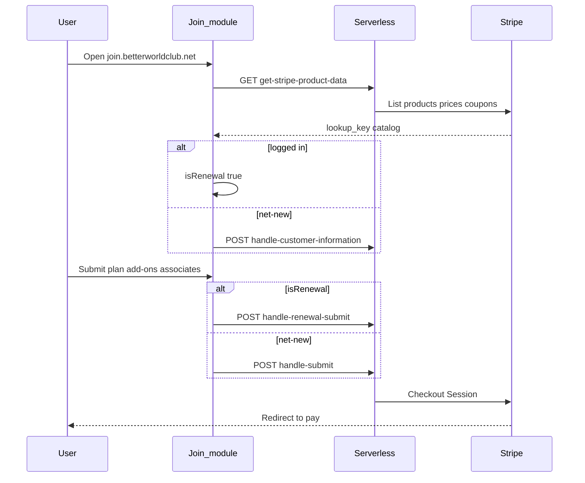

# Join form (`bwc-quote-form`)

HubSpot-hosted React Join / renewal module for `join.betterworldclub.net` (**Assumed** domain from handoff, not in these files). Loads Stripe products, collects member details, and starts Checkout.

## Visual

## Live vs archive

| Status | Path | Notes |
| --- | --- | --- |
| **Live** | `modules/app.module/` | HubL shell; injects contact JSON into the React app |
| **Live (bundled)** | `main.js` | Production UI: `isRenewal`, `lookup_key`, submit routing |
| **Incomplete vs bundle** | `src/App.js`, `src/StateStore.js`, `src/components/forms/FormContainer.js` | Older/incomplete sources. `FormContainer.js` still posts to a Heroku lead URL — **do not treat as live** |
| **Archive** | `orig_main.js`, `fixed_date_main.js`, `Orig-FormContainer copy 2.js`, `Testing-FormContainer copy.js` | Copies |

## How it works (Confirmed)

- **Product catalog.** On load, `GET /_hcms/api/get-stripe-product-data`. Primary plans are products with `metadata.primary_product`. Add-ons match via Stripe `lookup_key` containing the selected plan key (`main.js`). Missing/inactive lookup keys break add-on lists.
- **API URLs.** Relative `/_hcms/api/{endpoint}`. Preview hostnames append `?portalid=` (`buildApiUrl` in `main.js`). `hs_preview_key` skips CRM.
- **Renewal detection.** `setRenewal(contactData.loggedIn === 'true')` — **any logged-in Contact is treated as renewal**. That is the known “new signup routed as renewal” edge case.
- **Logged-in bootstrap.** HubL in `app.module/module.html` passes `data-logged-in`, contact fields, `data-stripe-id` (`contact.field_id`), and a GraphQL/association dump of `p_zaybra_subscription_collection__...`. First associated sub’s `billing_end_date` + 1 day becomes earliest renewal start.
- **Net-new step 1.** `POST handle-customer-information` with primary contact fields → `{ stripeCustomerId, contactId }`.
- **Submit.** Net-new → `handle-submit`. Renewal → `handle-renewal-submit` (includes `subscriptionData`). Response `{ session }` → `window.location.href`.
- **Green vehicle.** Checkbox; serverless applies coupon `Green_Vehicle_Discount_10` (see [03-serverless.md](./03-serverless.md)).
- **Carbon offset / associates.** Filtered from `lookup_key`; associates use a dedicated price ID.

## Open questions

- Which HubSpot page embeds `app.module` — **Unknown**.
