# Serverless (`cms-webpack-serverless-boilerplate`)

HubSpot CMS serverless under `/_hcms/api/...`. Runtime `nodejs18.x`. Contract: `app.functions/serverless.json`.

Most checkout/webhook files are **webpack bundles**. Document routes, not the bundled Stripe SDK.

## Visual

```mermaid
flowchart TB
  form[Join_form]
  portal[Member_portal]
  stripeWH[Stripe_webhooks]
  hsWH[HubSpot_webhooks]

  form --> products[get-stripe-product-data]
  form --> customer[handle-customer-information]
  form --> submit[handle-submit]
  form --> renew[handle-renewal-submit]
  portal --> billing[create-customer-portal-session]
  portal --> payStatus[get-payment-method-status]
  stripeWH --> joinDate[join-date-mapping]
  stripeWH --> successPay[handle-successful-payment]
  stripeWH --> lifecycle[handle-subscription-lifecycle]
  hsWH --> cardNo[generate-member-card-no]
  hsWH --> winner[updateContactFields]
  hsWH --> backfill[updateContactFieldsBackFill]
```

## Endpoint catalog (Confirmed from `serverless.json`)

### Checkout

| Route | File | Role |
| --- | --- | --- |
| `get-stripe-product-data` | `fetchStripeProductData.js` | Lists Stripe products/prices/coupons. Resolves green-vehicle promo for `Green_Vehicle_Discount_10`. |
| `handle-customer-information` | `handleCustomerInformation.js` | Creates/resolves Stripe Customer + HubSpot Contact. |
| `handle-submit` | `handleSubmit.js` | Builds Checkout Session (plan, associates, add-ons, carbon offset, start date). |

**Discounts (Confirmed in `handleSubmit.js`):** Stripe allows `discounts` **or** `allow_promotion_codes`, not both. If green-vehicle coupon is applied, Checkout uses `discounts`; otherwise `allow_promotion_codes = true`. Commented-out `first_year_discount` is not applied.

### Renewal

| Route | File | Role |
| --- | --- | --- |
| `handle-renewal-submit` | `handleRenewalSubmit.js` | Live renewal path from the form. Updates Stripe subscription (`subscriptions.update`) and creates a Checkout Session (`createAnchoredSession`). |
| `handle-renewal-purchase` | `handleRenewalPurchase.js` | **Currently a no-op.** `exports.main` logs `climateCleanKey` then `return;` before cancel-at-period-end / item update logic. |

### Post-pay / lifecycle

| Route | File | Role |
| --- | --- | --- |
| `handle-successful-payment` | `handleSuccessfulPayment.js` | Stripe webhook handler; includes `customer.subscription.created` branch. Bundled — confirm subscribed events in HubSpot/Stripe dashboard. |
| `handle-subscription-lifecycle` | `handleSubscriptionLifecycle.js` | Stripe lifecycle webhook. Bundled. |

### Portal

| Route | File | Role |
| --- | --- | --- |
| `create-customer-portal-session` | `createCustomerPortalSession.js` | Stripe Billing Portal session from `stripeCustomerId`. |
| `get-payment-method-status` | `getPaymentMethodStatus.js` | Payment-method status for portal display. |

### Identity / cards / mapping

| Route | File | Role |
| --- | --- | --- |
| `join-date-mapping` | `join-date-mapping.js` | Stripe `checkout.session.completed`. Sets Contact `join_date` from `event.created`. **Write-once.** Looks up Contact by email. |
| `generate-member-card-no` | `generate_mem_card_no.js` | HubSpot Contact webhook. Acks 204, then polls hapily Subscription (`2-32975090`) up to **30 minutes**. Writes unique `member_card_no`. Skips if already set. |
| `fieldMappingFunctions` | `fieldMappingFunctions.js` | Contact↔subscription mapping; same 30-minute hapily wait. |
| `mapContactSelfMapping` | `mapContactSelfMapping.js` | Contact self-mapping helper. |
| `subscription-field-sync` | `subscriptionFieldsOnlySync.js` | Sync subscription fields only. |

Additional `map*` files on disk are not in `serverless.json`.

### Reconciliation (Niko assumed)

| Route | File | Role |
| --- | --- | --- |
| `updateContactFields` | `updateContactFields.js` | Webhook on hapily Subscription (`2-32975090`). Winner selection; Contact denormalized fields; association label `typeId` 92. Does **not** call Stripe. |
| `updateContactFieldsBackFill` | `updateContactFieldsBackFill.js` | Same algorithm for batch/backfill. |

See [05-data-and-rules.md](./05-data-and-rules.md).

### Debug / archive (not production)

`debug-handle-submit`, `helloWorld.js`, `orig-serverless.json.js`, `orig_handleCustomerInformation copy.js`.

## Secrets (`serverless.json`)

Secrets are named in `serverless.json`. Verify whether `sandboxStripe` is actually the live key.

## Open questions

- Which Stripe events are subscribed to which endpoints — **Unknown** in this snapshot (confirm in Stripe + HubSpot webhook settings).
- Workflow triggers for card generation vs join date — **Unknown**.
- Whether `handle-renewal-purchase` is unused on purpose — Confirmed dead `return;` in this snapshot.
