# Serverless (`cms-webpack-serverless-boilerplate`)

HubSpot CMS serverless under `/_hcms/api/...`. Runtime `nodejs18.x`. Contract: `app.functions/serverless.json`.

Most checkout/webhook files are **webpack bundles**. Document routes, not the bundled Stripe SDK.

## Visual

```mermaid
flowchart TB
  form[Join_form]
  portal[Member_portal]
  stripeWH[Stripe_webhooks]
  hsWH[HubSpot_webhooks]

  form --> products[get-stripe-product-data]
  form --> customer[handle-customer-information]
  form --> submit[handle-submit]
  form --> renew[handle-renewal-submit]
  portal --> billing[create-customer-portal-session]
  portal --> payStatus[get-payment-method-status]
  stripeWH --> joinDate[join-date-mapping]
  stripeWH --> successPay[handle-successful-payment]
  stripeWH --> lifecycle[handle-subscription-lifecycle]
  hsWH --> cardNo[generate-member-card-no]
  hsWH --> winner[updateContactFields]
  hsWH --> backfill[updateContactFieldsBackFill]
```



## Live Stripe webhook data flow

**Confirmed in Stripe live mode on 2026-09-22** for Better World Holdings (`acct_1PIy6rKNMTeBGk8y`). All five destinations are enabled, receive snapshot payloads, and receive events from this account (`@self`).

```text
┌────────────────────────────┐
│ Stripe live account        │
│ Customers / subscriptions │
│ invoices / charges        │
└──────────────┬─────────────┘
               │ snapshot events
       ┌───────┼───────────────────────┬──────────────────────┬───────────────────┐
       │       │                       │                      │                   │
       ▼       ▼                       ▼                      ▼                   ▼
┌───────────┐ ┌──────────────────┐ ┌───────────────────┐ ┌────────────────┐ ┌───────────┐
│ Zaybra /  │ │ join-date-      │ │ handle-successful │ │ subscription-  │ │ Gift Up   │
│ hapily    │ │ mapping         │ │ -payment          │ │ lifecycle      │ │ coupons   │
└─────┬─────┘ └────────┬─────────┘ └─────────┬─────────┘ └───────┬────────┘ └─────┬─────┘
      │                │                     │                   │                │
      ▼                ▼                     ▼                   ▼                ▼
┌───────────┐  ┌───────────────┐   ┌─────────────────┐  ┌────────────────┐  ┌───────────┐
│ HubSpot   │  │ Contact       │   │ Climate Clean + │  │ hapily dates / │  │ Gift Up   │
│ hapily    │  │ join_date     │   │ date correction │  │ failed payment │  │ coupon    │
│ records   │  │ write-once    │   │                 │  │ handling       │  │ sync      │
└───────────┘  └───────────────┘   └─────────────────┘  └────────────────┘  └───────────┘
```

### Live destination inventory

| Destination | Owner | Snapshot API version | Enabled events | Purpose |
| --- | --- | --- | ---: | --- |
| `zaybra.webhook.a8labs.io/v2` | hapily/Zaybra | `2020-08-27` | 19 | Vendor-managed Stripe → HubSpot synchronization. Full query string intentionally omitted. |
| `/_hcms/api/handle-successful-payment` | BWC | `2024-04-10` | 2 | Successful-payment processing, Climate Clean Journal handoff, and effective/renewal-date correction. |
| `/_hcms/api/handle-subscription-lifecycle` | BWC | `2024-04-10` | 2 | Failed-payment/lifecycle handling and `paid_through` synchronization to hapily Subscription records. |
| `/_hcms/api/join-date-mapping` | BWC | `2024-04-10` | 1 | Write-once Contact join date. |
| `inbound.giftup.app/.../StripeCoupons/all` | Gift Up | `2022-11-15` | 4 | Coupon/discount integration; separate from the core membership sync. Full URL intentionally omitted. |

### Zaybra/hapily subscriptions

The live Zaybra destination receives these events. This confirms its inputs, not every API read or write the vendor might perform afterward.

- **Charges:** `charge.captured`, `charge.failed`, `charge.refunded`, `charge.succeeded`
- **Customers:** `customer.created`, `customer.updated`
- **Subscriptions:** `customer.subscription.created`, `customer.subscription.deleted`, `customer.subscription.pending_update_applied`, `customer.subscription.pending_update_expired`, `customer.subscription.trial_will_end`, `customer.subscription.updated`
- **Invoices:** `invoice.finalized`, `invoice.paid`
- **Subscription schedules:** `subscription_schedule.aborted`, `subscription_schedule.canceled`, `subscription_schedule.completed`, `subscription_schedule.created`, `subscription_schedule.updated`

### Event ownership and overlap

| Event | Zaybra/hapily | BWC custom | Gift Up |
| --- | --- | --- | --- |
| `checkout.session.completed` | — | `join-date-mapping` | — |
| `customer.subscription.created` | Sync consumer | `handle-successful-payment` | — |
| `customer.subscription.updated` | Sync consumer | `handle-subscription-lifecycle` | — |
| `customer.subscription.deleted` | Sync consumer | — | — |
| `invoice.paid` | Sync consumer | — | — |
| `invoice.payment_succeeded` | — | `handle-successful-payment` | — |
| `invoice.payment_failed` | — | `handle-subscription-lifecycle` | — |
| `invoice.finalized` | Sync consumer | — | Coupon consumer |

Overlap is intentional only when each consumer has a separate responsibility. The BWC handlers must remain idempotent because related Stripe events can describe the same subscription lifecycle change.

### Payload versions and ownership

- The Zaybra endpoint is pinned to snapshot API version `2020-08-27`; the BWC endpoints use `2024-04-10`. Different handlers can therefore receive different object shapes for related events.
- Do not upgrade the vendor endpoint without hapily confirmation and test-mode validation.
- A subscribed event does not prove that Zaybra calls the corresponding Stripe API. Exact vendor API reads/writes remain **Unknown** until verified in Stripe Workbench request logs or vendor documentation.
- Stripe configuration does not prove signature verification, idempotency, or error handling inside the BWC bundles. Those controls remain **Unknown** until the active handler code is verified.

Stripe references: [webhooks](https://docs.stripe.com/webhooks), [subscription webhooks](https://docs.stripe.com/billing/subscriptions/webhooks), [event destinations](https://docs.stripe.com/workbench/event-destinations), and [webhook versioning](https://docs.stripe.com/webhooks/versioning).

## Endpoint catalog (Confirmed from `serverless.json`)

### Checkout

| Route | File | Role |
| --- | --- | --- |
| `get-stripe-product-data` | `fetchStripeProductData.js` | Lists Stripe products/prices/coupons. Resolves green-vehicle promo for `Green_Vehicle_Discount_10`. |
| `handle-customer-information` | `handleCustomerInformation.js` | Creates/resolves Stripe Customer + HubSpot Contact. |
| `handle-submit` | `handleSubmit.js` | Builds Checkout Session (plan, associates, add-ons, carbon offset, start date). |

**Discounts (Confirmed in `handleSubmit.js`):** Stripe allows `discounts` **or** `allow_promotion_codes`, not both. If green-vehicle coupon is applied, Checkout uses `discounts`; otherwise `allow_promotion_codes = true`. Commented-out `first_year_discount` is not applied.

### Renewal

| Route | File | Role |
| --- | --- | --- |
| `handle-renewal-submit` | `handleRenewalSubmit.js` | Live renewal path from the form. Updates Stripe subscription (`subscriptions.update`) and creates a Checkout Session (`createAnchoredSession`). |
| `handle-renewal-purchase` | `handleRenewalPurchase.js` | **Currently a no-op.** `exports.main` logs `climateCleanKey` then `return;` before cancel-at-period-end / item update logic. |

### Post-pay / lifecycle

| Route | File | Live Stripe events | Role |
| --- | --- | --- | --- |
| `handle-successful-payment` | `handleSuccessfulPayment.js` | `invoice.payment_succeeded`, `customer.subscription.created` | Net-new and renewal post-payment work; Stripe description names Climate Clean Journal and effective/renewal-date correction. Bundled — verify the field-level behavior in active code. |
| `handle-subscription-lifecycle` | `handleSubscriptionLifecycle.js` | `invoice.payment_failed`, `customer.subscription.updated` | Failed-payment/lifecycle work; Stripe description names `paid_through` synchronization to hapily Subscription records. Bundled — verify the field-level behavior in active code. |

### Portal

| Route | File | Role |
| --- | --- | --- |
| `create-customer-portal-session` | `createCustomerPortalSession.js` | Stripe Billing Portal session from `stripeCustomerId`. |
| `get-payment-method-status` | `getPaymentMethodStatus.js` | Payment-method status for portal display. |

### Identity / cards / mapping

| Route | File | Role |
| --- | --- | --- |
| `join-date-mapping` | `join-date-mapping.js` | Stripe `checkout.session.completed`. Sets Contact `join_date` from `event.created`. **Write-once.** Looks up Contact by email. |
| `generate-member-card-no` | `generate_mem_card_no.js` | HubSpot Contact webhook. Acks 204, then polls hapily Subscription (`2-32975090`) up to **30 minutes**. Writes unique `member_card_no`. Skips if already set. |
| `fieldMappingFunctions` | `fieldMappingFunctions.js` | Contact↔subscription mapping; same 30-minute hapily wait. |
| `mapContactSelfMapping` | `mapContactSelfMapping.js` | Contact self-mapping helper. |
| `subscription-field-sync` | `subscriptionFieldsOnlySync.js` | Sync subscription fields only. |

Additional `map*` files on disk are not in `serverless.json`.

### Reconciliation (Niko assumed)

| Route | File | Role |
| --- | --- | --- |
| `updateContactFields` | `updateContactFields.js` | Webhook on hapily Subscription (`2-32975090`). Winner selection; Contact denormalized fields; association label `typeId` 92. Does **not** call Stripe. |
| `updateContactFieldsBackFill` | `updateContactFieldsBackFill.js` | Same algorithm for batch/backfill. |

See [05-data-and-rules.md](./05-data-and-rules.md).

### Debug / archive (not production)

`debug-handle-submit`, `helloWorld.js`, `orig-serverless.json.js`, `orig_handleCustomerInformation copy.js`.

## Secrets (`serverless.json`)

Secrets are named in `serverless.json`. Verify whether `sandboxStripe` is actually the live key. Never document secret values or webhook signing secrets.

## Open questions

- Do all three BWC Stripe handlers verify the `Stripe-Signature` header against the correct endpoint-specific secret?
- How do the BWC handlers deduplicate and safely retry related or repeated events?
- Are equivalent endpoints configured and tested in Stripe test mode?
- Which exact Stripe API calls does Zaybra make after receiving an event? Event subscriptions alone do not answer this.
- Workflow triggers for card generation vs join date — **Unknown**.
- Whether `handle-renewal-purchase` is unused on purpose — Confirmed dead `return;` in this snapshot.
