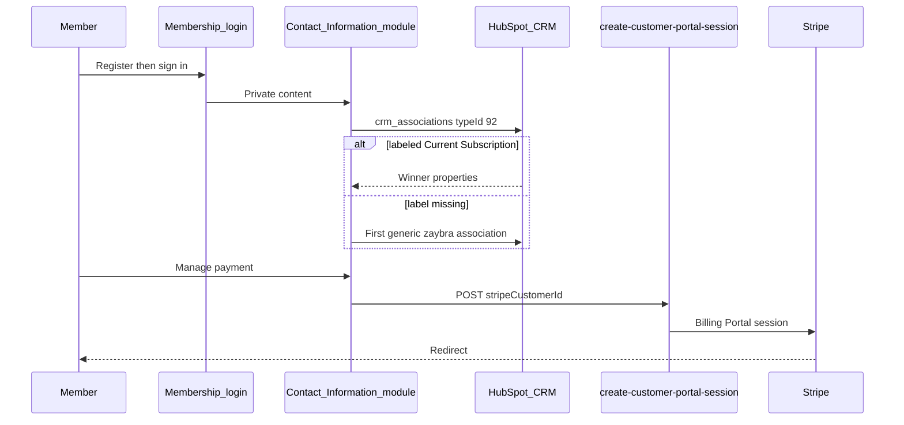

# Member portal (`Spark-copy`)

HubSpot theme for the private membership site (`members.betterworldclub.net`, **Assumed** domain). Shows contact + current membership and links to Stripe Billing Portal.

Ignore Spark marketing/blog modules. They are theme boilerplate.

## Visual

## Live vs archive

| Status | Path | Notes |
| --- | --- | --- |
| **Live** | `modules/custom_modules/Contact Information.module/` | Current membership UI |
| Archive / test | `Original Contact Information.module`, `Test_Contact Information.module` | Older association/Billing Portal variants |
| Login | `pages/system/custom_membership-login.html` | HubSpot `member_login` |
| Related system pages | `aptitude-8-membership-register .html`, `custom_membership-reset-password .html`, access-denied variants | Multiple historical copies — which is live is **Unknown** |
| Card email | `memebrship.functions/emailMembershipCards.js` | `GET emailCards?contactId=` sets `send_membership_cards_via_email = true` (does not send email itself) |
| Theme | `theme.json`, `css/`, `pages/site-*.html` | Spark boilerplate |

Object naming: HubL still uses **zaybra** (`p_zaybra_subscription_collection__contact_to_zaybra_subscription`). Zaybra was rebranded to saas·hapily.

## How it works (Confirmed)

- **Current Subscription first.** `crm_associations(contactId, "USER_DEFINED", 92, "limit=1", "<properties>", false)`. Properties requested: `subscription_id,products,subscription_status,renewal_date,billing_end_date,billing_start_date,paid_through,customer_name,customer_id,payment_method`. If those properties are omitted, HubL returns IDs only (known edge case).
- **Fallback.** If label 92 is empty, uses `items[0]` on the generic zaybra association — which can be a **canceled** or **delta** row. That is why the label must stay correct.
- **Contact block.** Name, email, phone, address; HubSpot form for updates.
- **Membership block.** `member_card_no`, VIN if present, `join_date` as “Member Since”, plan/products, billing window, status (including past-due styling).
- **Billing Portal.** Client JS `createPortalSession` POSTs to `/_hcms/api/create-customer-portal-session` with `sub.customer_id`. Alerts if missing.
- **Preview.** `hs_preview_key` skips CRM and shows a placeholder.

In-progress (Wallet, print, GreenRope): see [06-gaps-and-ops.md](./06-gaps-and-ops.md).

Access-group enrollment and registration email are HubSpot private-content settings, not in these files (**Unknown** exact list/group names).

## Open questions

- Which login/register/reset template is attached to the live membership pages.
