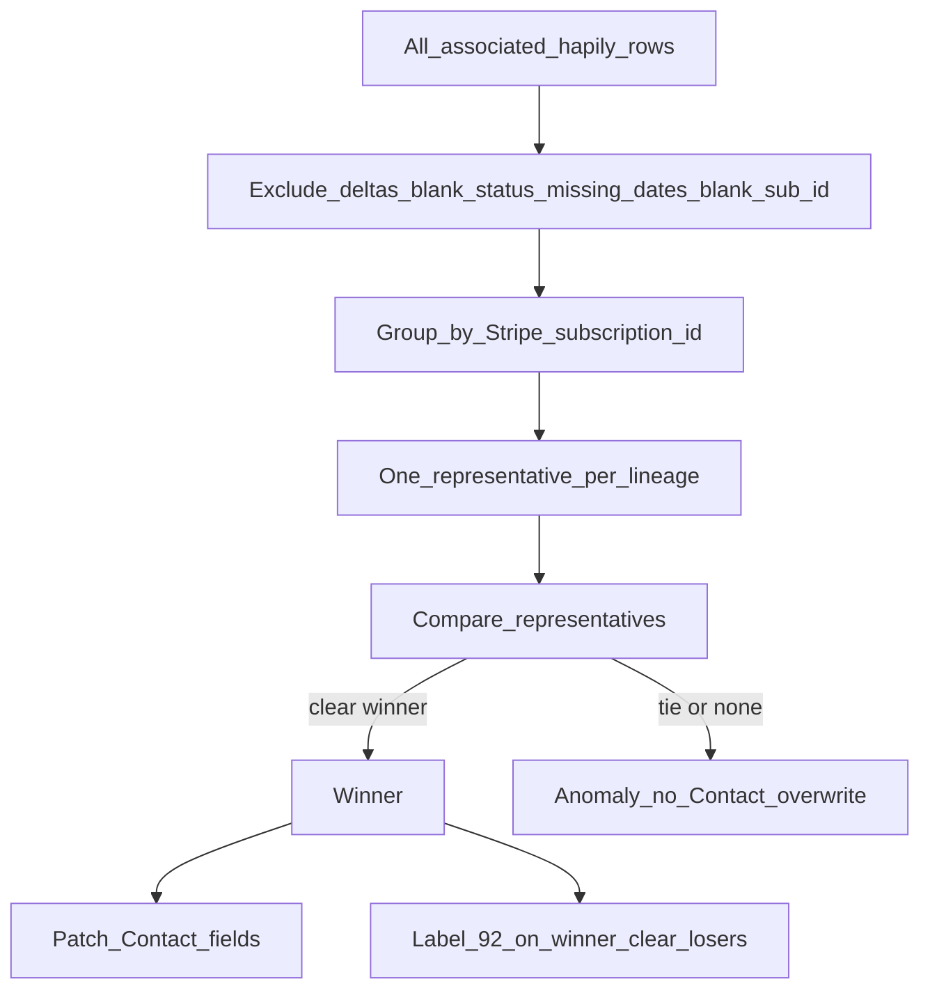

# Data and rules

How BWC turns many hapily Subscription rows into one Contact + portal view. This is not a hapily property catalog.

hapily object in this portal: custom object **`2-32975090`**. Current Subscription label: HubSpot association **`typeId` 92** (Contact → Subscription); reverse **93**.

Hapily vs BWC overlay: see [01-current-state.md](./01-current-state.md). This page is the winner algorithm.

## Winner selection (Confirmed — `updateContactFields.js`)

1. Load all hapily Subscriptions associated to the Contact (paged).
2. **Exclude** if:
   - `subscription_type` is populated (hapily Upgrade/Downgrade delta)
   - `subscription_status` blank
   - `billing_start_date` or `billing_end_date` missing
   - `subscription_id` blank
3. Group remaining by Stripe `subscription_id`. Pick one representative per group.
4. Sort key (same function for representative and overall winner):
   - Latest `billing_end_date`
   - Then latest `billing_start_date`
   - Then validation bucket: `RENEWED_VALIDATED` > `CANCELED_VALIDATED` > `UNVALIDATED`
   - Then highest HubSpot object ID (technical only)
5. If top two share the same billing window **and** the same validation bucket → **no winner** (anomaly). Object ID is not used to break that tie.
6. On winner: copy fields onto Contact **only if they differ**; skip empty source values. Clear anomaly flags.
7. On no winner: set `subscription_sync_anomaly` / `subscription_sync_anomaly_reason`. **Do not** overwrite billing/status/products. Clear Current Subscription labels on the eligible subset.
8. Does **not** write cancellation-intent fields.

Validation buckets (supporting signals only — they do not replace billing-window comparison):

- **RENEWED_VALIDATED:** `paid_through` and `renewal_date` both present
- **CANCELED_VALIDATED:** status `canceled` (British `cancelled` normalized), `paid_through` in the past, no `renewal_date`

## Source-of-truth matrix

| Field / event | Authority | HubSpot landing |
| --- | --- | --- |
| Payment, plan, coupon, collection method | Stripe | hapily Subscription (hapily sync) |
| Stripe Customer / Subscription IDs | Stripe | hapily `customer_id`, `subscription_id`; Contact `field_id` (Join HubL) |
| Contact match | hapily (email) | Contact |
| Upgrade/downgrade history | hapily delta row (`subscription_type`) | Excluded from winner |
| Current membership display | BWC winner algorithm | Contact denormalized fields + label 92 |
| `join_date` | Stripe `checkout.session.completed` → `event.created` | Contact, write-once |
| `member_card_no` | BWC generator after hapily sub exists | Contact, skip if set |
| `member_id` | Legacy / Contact id fallback | Contact; card uses last 5 digits |
| Portal login | HubSpot private content | Access group (**Unknown** name) |
| Cancellation **intent** | **Unknown** in this snapshot | Not updated by `updateContactFields` |

## Contact fields written by winner selection

| Contact | From hapily Subscription |
| --- | --- |
| `billing_start_date` | `billing_start_date` |
| `billing_end_date` | `billing_end_date` |
| `status_of_membership` | `subscription_status` (`cancelled` → `canceled`) |
| `products` | `products` |
| `coupon` | `coupon` |
| `discount` | `discount` |
| `subscription_sync_anomaly` | set/cleared by algorithm |
| `subscription_sync_anomaly_reason` | set/cleared by algorithm |

## Other identifiers (do not conflate)

| ID | Meaning |
| --- | --- |
| Contact email | Default identity; alias emails `club+<member_id>@betterworldclub.com` are **Assumed** from project notes, not coded in this snapshot |
| `field_id` | Stripe Customer ID on Contact (Join module) |
| `subscription_id` | Stripe Subscription |
| `member_id` | Membership identity |
| `member_card_no` | Printed/displayed card number (`{2-digit}00000{last-5-of-member_id}`) |
| hapily object id | HubSpot record id; not Stripe |

## Dates

| Date | Meaning in this snapshot |
| --- | --- |
| `join_date` | First successful Checkout (`event.created`), ISO `YYYY-MM-DD`, write-once |
| `billing_start_date` / `billing_end_date` | hapily current cycle; **primary** winner key |
| `paid_through` / `renewal_date` | Validation signals only |
| Renewal form min start | First associated sub `billing_end_date` + 1 day (`main.js`) — **not** necessarily the labeled Current Subscription |

## Status mapping

Contact `status_of_membership` is a copy of hapily `subscription_status` with spelling normalized. Portal past-due color is a display rule on that status. Full Stripe → portal behavior matrix beyond that copy is **Assumed**.

## Open questions

- Alias-email mapping implementation — not in these three folders.
- `requested_cancellation` / `requested_cancellation_date` — **not present** in this snapshot.
